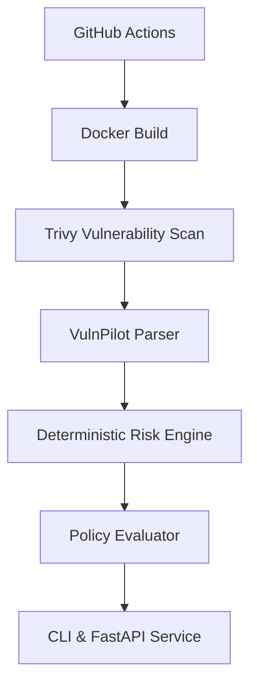

# VulnPilot

**VulnPilot — AI-Assisted DevSecOps Pipeline for Kubernetes Vulnerability Triage and Policy Enforcement**

## 1. Problem Statement

Traditional container security scanners generate large numbers of CVEs and security findings. Reviewing these manually is time-consuming and prone to human error. VulnPilot aims to automatically collect these findings, enrich and prioritize them, explain why important vulnerabilities matter, enforce security policies, and prevent unsafe workloads from progressing through the deployment pipeline.

## 2. Motivation

Security should not be a bottleneck in a DevSecOps pipeline. By combining deterministic risk scoring with AI-assisted triage, security engineers and developers can focus on vulnerabilities that actually matter in their context.

## 3. Architecture

The current architecture implements the core deterministic parsing, risk scoring, and policy evaluation capabilities. The AI-assisted triage layer currently uses a deterministic fallback mechanism.



## 4. Features

- **Trivy JSON Parsing**: Converts Trivy vulnerability reports into normalized Pydantic models.
- **Deterministic Risk Scoring**: Evaluates vulnerabilities contextually based on internet exposure and runtime environment.
- **Policy Enforcement**: Blocks or warns on deployments based on declarative YAML policies.
- **CLI & REST API**: Typer-based CLI for local execution and a FastAPI endpoint for remote service integration.
- **Kubernetes Hardening**: Provides initial Gatekeeper policies and Falco rules for securing cluster runtime environments.

## 5. Technology Stack

- Python 3.9+
- Pydantic (Data modeling)
- Typer (CLI)
- FastAPI (REST Service)
- Pytest (Testing)

## 6. Project Layout

```text
.
├── src/
│   └── vulnpilot/
│       ├── api/          # FastAPI Routes & Schemas
│       ├── policy/       # Declarative Policy Evaluator
│       ├── scanners/     # Trivy JSON Parser & Pydantic Models
│       └── triage/       # Risk Engine & AI Analyzer (Fallback)
├── tests/                # Pytest Test Suite
├── policies/             # YAML Pipeline Policies & Gatekeeper Configs
├── kubernetes/           # Sample Hardened Deployment Manifests
├── falco/                # Custom Falco Rules
└── docs/                 # Threat Model & Documentation
```

## 7. Installation

```bash
# 1. Create a virtual environment
python -m venv .venv
source .venv/bin/activate  # On Windows: .venv\Scripts\activate

# 2. Install dependencies
pip install -r requirements.txt
pip install -e .

# 3. Run the CLI
vulnpilot --help
```

## 8. Quickstart Local Demo

To parse a sample Trivy vulnerability report and evaluate it against policies:

```bash
vulnpilot scan tests/fixtures/trivy_sample.json --policy-file policies/pipeline-policy.yaml
```

**Example Output:**

```
[*] Parsed 3 vulnerabilities from tests/fixtures/trivy_sample.json
  - CVE-2023-1234 [HIGH] -> Risk Score: 90 (CRITICAL)
  - CVE-2023-5678 [MEDIUM] -> Risk Score: 60 (MEDIUM)

[*] Policy Decision: BLOCK
  ! Vulnerability CVE-2023-1234 violates policy: Maximum allowed CRITICAL is 0
```

## 9. Limitations (Honest Assessment)

- **AI Integration**: The AI Triage layer is currently stubbed out and relies entirely on deterministic fallback logic. No actual external LLMs are integrated yet.
- **Risk Score Sources**: The Risk Engine currently calculates scores purely based on CVSS and static environment context; it does not yet integrate with live EPSS or KEV databases.
- **Test Coverage**: While parsing and policy evaluation are well-tested, API routes and the CLI command handler currently lack comprehensive test coverage.
