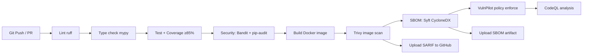

# CI/CD Pipeline Guide

## Pipeline Stages

## Stage Descriptions

| Stage | Tool | Failure = Block? | Notes |
|-------|------|-------------------|-------|
| Lint | ruff | Yes | Style + import hygiene |
| Type check | mypy | Yes | `--ignore-missing-imports` |
| Test | pytest | Yes | Coverage gate ≥ 85% |
| Security | bandit + pip-audit | Yes | Source code + dependency vulnerabilities |
| Build | Docker Buildx | Yes | Multi-stage; image never pushed on PR |
| Trivy scan | trivy-action | No (reports only) | SARIF uploaded to GitHub Security tab |
| SBOM | Syft | No | CycloneDX JSON artifact |
| Policy enforce | vulnpilot CLI | Yes (on tagged release) | `policies/pipeline-policy.yaml` |
| CodeQL | github/codeql-action | Yes | Python security analysis |

## Permissions

Each job uses the minimum `permissions:` needed.
No job has `write-all`.  `id-token: write` is only on the build job (for future cosign OIDC signing).

## Pinned Actions

All third-party actions are pinned to immutable commit SHAs to prevent
supply chain attacks (see `.github/workflows/ci.yml`).

## Secrets

| Secret | Where Stored | Usage |
|--------|-------------|-------|
| `OPENAI_API_KEY` | GitHub Encrypted Secrets | Injected at runtime; never in logs |
| Docker credentials | Not needed — image not pushed on PR | |
| Azure credentials | Not in CI yet — Terraform apply is manual | |

## SBOM and Signing (Tagged Releases)

On `git tag v*`, a future job will:
1. Push the image to GHCR / ACR
2. Sign it with `cosign` using keyless OIDC
3. Attach the SBOM as an attestation

This is **not yet implemented** in the current CI — it is documented as a
next step in `docs/AUDIT.md`.
