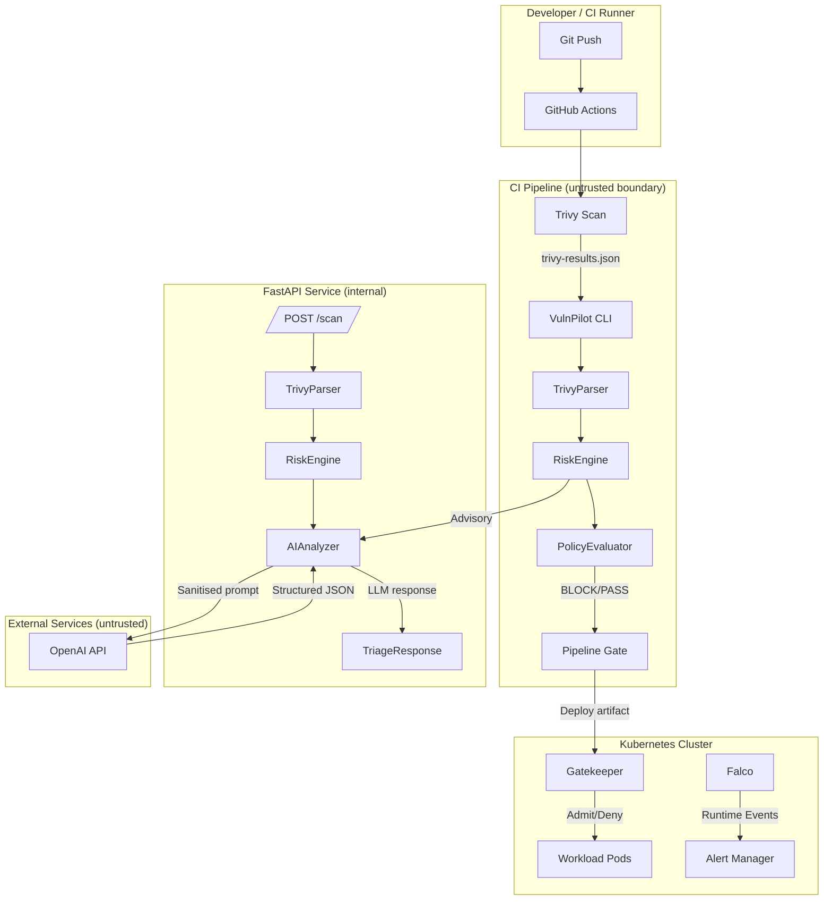

# VulnPilot Threat Model (STRIDE)

## 1. System Overview

VulnPilot is an AI-assisted DevSecOps pipeline that ingests Trivy vulnerability
scan results, scores them deterministically, enforces YAML-based security policies,
optionally enriches triage with an LLM, and prevents unsafe container workloads
from deploying into Kubernetes.

## 2. Data Flow Diagram

## 3. Trust Boundaries

| Boundary | Description |
|----------|-------------|
| CI Pipeline | GitHub Actions environment; code and scan results are untrusted |
| Trivy JSON Output | Scanner output is untrusted and may be tampered via supply chain |
| OpenAI API | External; must receive no secrets or internal data |
| Kubernetes Cluster | Admission controller and runtime security enforce least-privilege |
| Developer Workstation | Out of scope; assume developers are trusted but make mistakes |

## 4. STRIDE Analysis

### S — Spoofing

| Threat | Attacker forges a Trivy JSON report with no vulnerabilities to bypass policy |
|--------|----------------------------------------------------------------------------|
| Impact | Unsafe container deployed to production |
| Mitigation | Pydantic schema validation on all parsed fields (`scanners/models.py`); CI generates its own Trivy report — does not accept user-supplied scan files |
| Code Reference | `src/vulnpilot/scanners/trivy.py`, `src/vulnpilot/scanners/models.py` |

### T — Tampering

| Threat | Supply chain attack modifies `requirements.txt` to inject a malicious dependency |
|--------|----------------------------------------------------------------------------------|
| Impact | Compromised VulnPilot binary; arbitrary code in CI |
| Mitigation | `pip-audit` in CI scans all dependencies; Dependabot opens PRs on version bumps; GitHub Actions pinned to commit SHAs |
| Code Reference | `.github/workflows/ci.yml`, `.github/dependabot.yml` |

### R — Repudiation

| Threat | Attacker denies making a malicious policy change |
|--------|--------------------------------------------------|
| Impact | Inability to trace who allowed a vulnerable deployment |
| Mitigation | All policy changes tracked in Git history; GitHub Actions logs with timestamps; tool calls in `ToolRegistry` are logged |
| Code Reference | `src/vulnpilot/rag/tools.py:ToolRegistry.call()` |

### I — Information Disclosure

| Threat | Internal hostnames, API keys, or private IP addresses are sent to the OpenAI API |
|--------|----------------------------------------------------------------------------------|
| Impact | Credential compromise; internal network map exposed |
| Mitigation | `redaction.py` strips API keys, bearer tokens, private IPs, internal hostnames before any external call; `OPENAI_API_KEY` injected from Key Vault at runtime |
| Code Reference | `src/vulnpilot/triage/redaction.py`, `infra/main.tf` |

### D — Denial of Service

| Threat | LLM rate limiting stalls the CI pipeline |
|--------|------------------------------------------|
| Impact | Security reviews blocked; developers bypass security checks |
| Mitigation | `_CircuitBreaker` opens after 3 failures; `FallbackProvider` is always available; `_REQUEST_TIMEOUT = 10s` caps wait time |
| Code Reference | `src/vulnpilot/triage/providers.py:_CircuitBreaker` |

### E — Elevation of Privilege

| Threat | Vulnerability in FastAPI allows container breakout to K8s node |
|--------|---------------------------------------------------------------|
| Impact | Full cluster compromise |
| Mitigation | Container runs as UID 10001 (non-root); `readOnlyRootFilesystem: true`; all capabilities dropped; Gatekeeper blocks privileged pods; Falco detects shell spawn and writes to `/etc` |
| Code Reference | `kubernetes/deployment.yaml`, `policies/rego/k8s_security.rego`, `falco/custom-rules.yaml` |

## 5. Assets and Impact

| Asset | Confidentiality | Integrity | Availability |
|-------|-----------------|-----------|--------------|
| CVE scan data | Low | High | Medium |
| OpenAI API key | Critical | N/A | N/A |
| Policy YAML | Medium | Critical | Medium |
| Container images | Low | Critical | High |
| Kubernetes secrets | Critical | Critical | High |

## 6. Residual Risks

- **Live cloud deployment not tested** — Terraform has been validated but not applied to a real Azure subscription.
- **LLM hallucinations** — Confidence field provided; human review recommended for LLM-assisted decisions.
- **Rego tests require OPA** — `opa test` must be run separately; not yet in CI.
